## Mục lục

[1. Tạo khoá học](#1)

[2. Chỉnh sửa bài học trong khoá học](#2)

[3. Add video hướng dẫn điểm danh](#3)

[4. Tạo session điểm danh](#4)

[5. Tạo link telegram group cho học viên join](#5)

[6. Tạo meeting cho từng buổi học](#6)

[7. Chia sẻ tài liệu và video record](#7)

[8. Cấu hình cho học viên đăng ký khoá học](#8)

[9. Cấu hình email confirm](#9)

[10. Tạo quiz](#10)

[11. Thống kê điểm danh](#11)

[12. Tạo certificate](#12)

## 1. Tạo khoá học

Truy cập vào địa chỉ: https://portal.itforvn.com bằng tài khoản có quyền `admin`

Dấu hiệu để nhận biết bạn có đang làm admin không thì bạn sẽ thấy có button `Site administration`

Bạn nhấn vào `Site administration` để bắt đầu tạo course

Tiếp đến, bạn chọn vào tab `Courses` để vào phần tạo course

Chọn tiếp vào `Manage courses and categories` để tạo các khoá học theo từng chủ đề.

Tôi thực hiện tạo một khoá học về Linux nên sẽ chọn ở cột `Course categories` là `Linux`. 

Nếu bạn muốn tạo bài học về một chủ đề chưa có thì có thể tạo mới bằng cách nhấn vào `CREATE NEW CATEGORY`

Tại phần tạo category mới, bạn điền các thông tin cần thiết. Các phần thông tin có dấu `!` là bắt buộc.

Sau khi khởi tạo xong thì sẽ có một catagory mới

Sau khi lựa chọn vào chủ đề `LINUX` thì tại phần bên phải màn hình sẽ có thông tin để khởi tạo khoá học trong chủ đề đó.

Điền tên của khoá học và mô tả các thông tin liên quan tới khoá học. Do tạo test nên tôi chọn `Course visibility` là `Hide`. Thời gian khoá học sẽ do bạn lựa chọn, giá trị mặc định là 1 năm.

Các thông tin khác bạn để mặc định, sau này có cần thay đổi gì thì vào chỉnh sửa. Nhấn vào `SAVE AND RETURN`

OK. Chúng ta đã bước đầu khởi tạo xong một khoá học. Bây giờ sẽ tạo khung outline cho khoá học. Chúng ra ta ngoài `Home` sẽ thấy khoá học mà chúng ta vừa tạo

## 2. Chỉnh sửa bài học trong khoá học

Để có thể chỉnh sửa khoá học, từ Home ta click vào khoá học. tại góc trên cùng bên trái có biểu tượng bánh răng, ta chọn vào đó và chọn `Turn editting on`

Tới đây, khoá học có bao nhiêu buổi và tóm tắt nội dung từng bài học. Chọn vào cái bút để chỉnh sửa tên topic

Sau đó, Chọn vào `Edit` --> `Edit topic` để điền nội dung tóm tắt cho bài học

Điền các thông tin tóm tắt theo outline của giảng viên, sau đó Save lại

Làm tương tự với các Topic khác. Để mặc định sẽ có 4 topic, nếu cần thêm topic cho bài học thì chọn `Add topic`

## 3. Add video hướng dẫn điểm danh

Trong khoá học, sẽ có thời điểm yêu cầu học viên điểm danh để đảm bảo học viên đang tập trung học.

Ta thực hiện `Add an activity or resource` và chọn một `Resources` là Url, thêm vào link video tới youtube. đây là link hướng dẫn mọi người vào điểm danh trong quá trình học.

Trong phần thông tin của URL, ta điềm link `https://www.youtube.com/watch?time_continue=2&v=rcllwrdmGvQ`. Lưu ý chọn `display` trong `Appearance` là `In pop-up` để lúc video được play thì nó sẽ play ở một cửa sổ khác, không ảnh hưởng tới cửa sổ đang thao tác của học viên. Chọn save.

Ngoài ra, có một check list bắt buộc học viên phải thực hiện task đó, một số activity hay resource ta không cần, lúc thêm vào ta lựa chọn loại bỏ check list này. Check list này áp dụng bắt buộc cho một số quiz, còn lại đa số không cần. Cấu hình bỏ check list này đi bằng cách edit lại `activities` hay `resources`

## 4. Tạo session điểm danh

Vào `Add an activity or resource` và chọn ở `activities` mục `attendance`

Sau đó điền thông tin cho activity

Cũng sẽ bỏ check như hướng dẫn

Sau khi tạo xong, phần home sẽ như sau

Ta tạo các session điểm danh trong quá trình học bằng cách chọn vào `Điểm danh`

Trong đây, ta vào tab `Add session` và thêm một session điểm danh. Lưu ý time hệ thống để là 24h thì phải chọn đúng, nếu time hệ thống để am, pm thì phải chọn đúng. Các phần còn lại để nguyên. Chọn `Add`

Nếu chọn sai time thì xoá session điểm danh đó đi và tạo lại. Với các session điểm danh đã được thực hiện thì ko được xoá, vì sẽ mất dữ liệu điểm danh của buổi đó.

## 5. Tạo link telegram group cho học viên join

Phần này thì chủ yếu thao tác trên app telegram. Sau khi tạo ra một group trên telegram, ta vào phần `Group info` --> `manage group` --> `group type` --> `Create an invite link`

Sau khi có link invite, ta copy link đó và thực hiện thao tác `Add an activity or resource` và chọn URL để đặt link đó vào.

## 6. Tạo meeting cho từng buổi học

Đây là tạo ra phiên conference để các học viên join vào lớp học. Có thể là gotomeeting hoặc teams, zoom,...

Nếu là teams của Microsoft thì thì vào trong `Teams` --> `Meetings` --> `Schedule a meeting`

Sau đó điền các thông tin như tên, chọn thời gian bắt đầu, tgian kết thúc. Chọn channel cho các thành viên sẽ join dc vào channel. Chọn `Schedule` để khởi tạo

Sau khi tạo xong meeting, ta cần để link lên portal để các học viên join. Có thể vào channel để xem meeting mình vừa tạo rồi copy link hoặc vào thẳng Meeting tại App teams để xem schedule và lấy link.

Thực hiện thao tác copy link và tạo một `Resource` là URL để đặt link join vào đó.

Cũng lưu ý các mục display thì chọn `In pop-up` và loại bỏ check list đi.

Ngoài ra, trong meeting mà chọn channel thì chỉ những thành viên thuộc channel mới có thể trao đổi với nhau. các học viên khác có join vào meeting chỉ coi dc video chứ ko xem dc nội dung chat. Nếu bạn ko chọn channel thì mặc định là public, các học viên cứ join dc meeting là trao đổi dc với nhau.

Các admin thực hiện tạo meeting cần join sớm để các học viên có thể join dc. Các học viên ko thuộc channel nếu join bằng link thì cần dc admit để có thể join vào. Các admin lưu ý admit cho học viên.

Trước mỗi buổi học cần cập nhật link meeting trên portal.

## 7. Chia sẻ tài liệu và video record

Sử dụng Onedrive để lưu trữ và chia sẻ tài liệu cho các học viên vào tải về.

**Phần này cần guide thêm để biết cách tạo**

## 8. Cấu hình cho học viên đăng ký khoá học

Tại phần khoá học, lựa chọn `Participants` --> `Enrollment methods`

Tại cửa sổ giao diện mới, chọn vào `Course enrol confirmation` 

Và sửa title của nó thành `Đăng ký`, sau đó save lại

Tạo thử một tài khoản học viên (khác admin) để test việc đăng ký khoá học vừa tạo ở trên. Vào bằng một trình duyệt ẩn danh và nhấn vào đăng ký tài khoản. điền các thông tin theo yêu cầu.

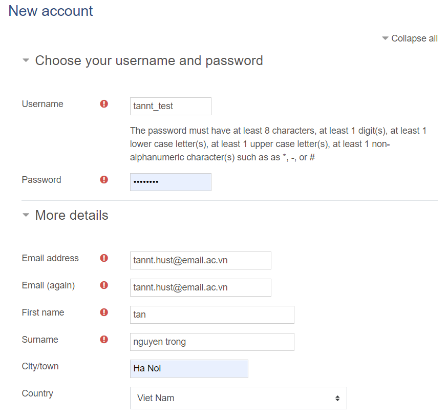

Truy cập vào email để kích hoạt tài khoản.

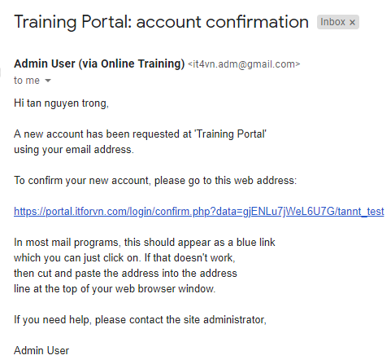

Sau khi đăng nhập vào portal bằng tài khoản vừa tạo, ta sẽ không thấy được khoá học do admin tạo với chế độ `Hide`. Ta vào bằng tài khoản admin và chuyển sang chế độ `show` để test. Khi bạn chọn vào khoá thì sẽ hiện thông tin bắt phải `enrol`

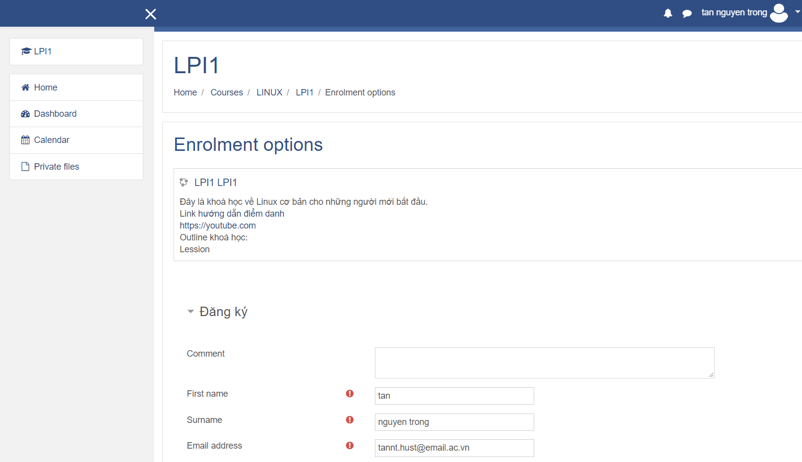

Bạn cập nhật trường thông tin sđt và nhấn vào `enrol me`

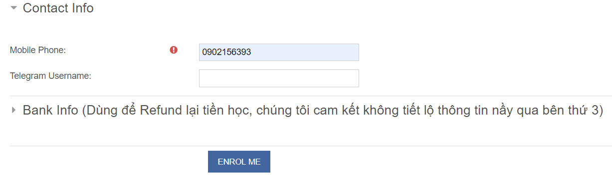

Chuyển sang tài khoản admin, và vào `participants` ta sẽ thấy danh sách học viên vừa enrol

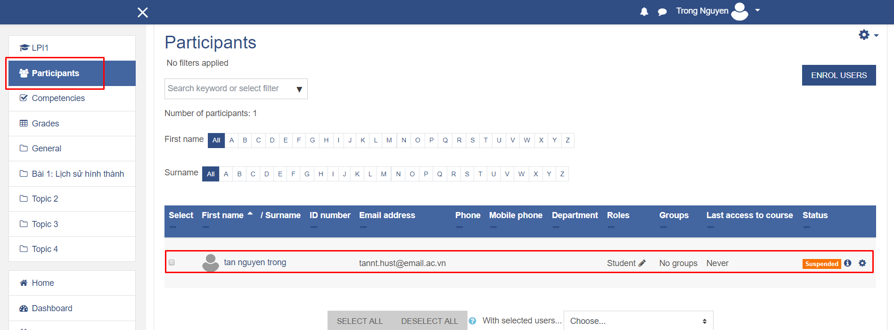

Việc check cú pháp đăng ký theo hướng dẫn đúng theo cú pháp thì sẽ được `accept`

## 9. Cấu hình email confirm

Tạo ra một template email bằng cách vào `Site administration` --> chọn tới tab `Plugins` --> Kéo xuống tới phần `Enrolments` và chọn vào `Course enrol confirmation`. `Confirmation email` là nội dung email sẽ gửi cho học viên khi đăng ký khoá học.

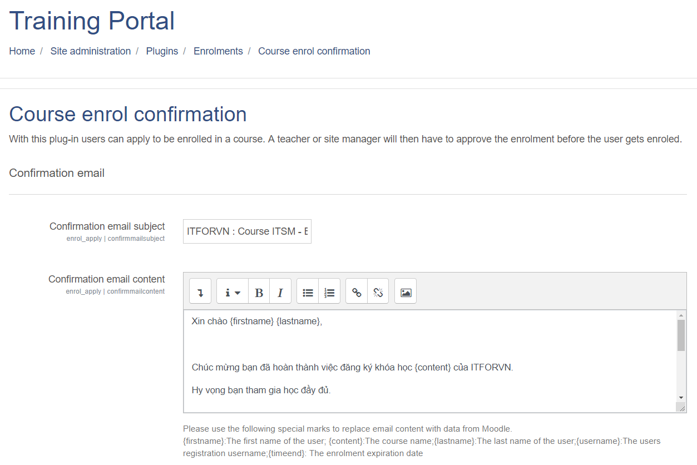

Đây là email template dùng chung cho rất nhiều khoá học, nên nếu bạn đang mở đăng ký cho một khoá nào đó, bạn phải sửa lại nội dung cho phù hợp với khoá đó. Email sẽ get một số biến là tên của học viên.

**note**: phần send email đã được cấu hình từ trước.

Phần template `waiting list email` là nội dung email sẽ gửi tới học viên sau khi được join vào lớp

Phần `cancelation email` là nội dung email mà học viên đăng ký sai cú pháp

Tại phần enrol, admin phải tuỳ chỉnh lại một số tên của trường thông tin như `Comment` chuyển thành `register_code` thì phải vào lại khoá học từ home --> vào`Participants` --> setting chọn `enrolment methods` --> tại dòng `Đăng ký`, chọn vào `setting` 

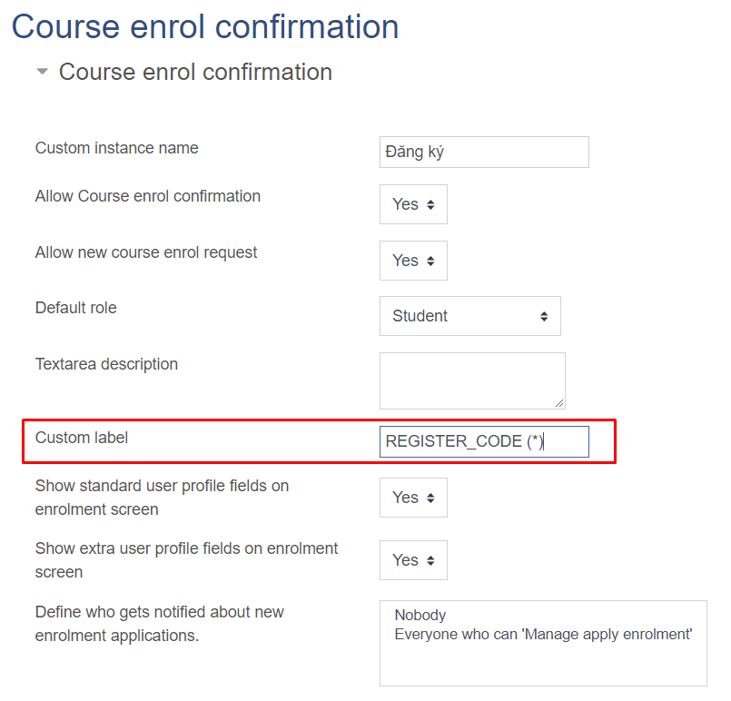

Khi thêm trường thì giao diện lúc đăng ký sẽ như sau

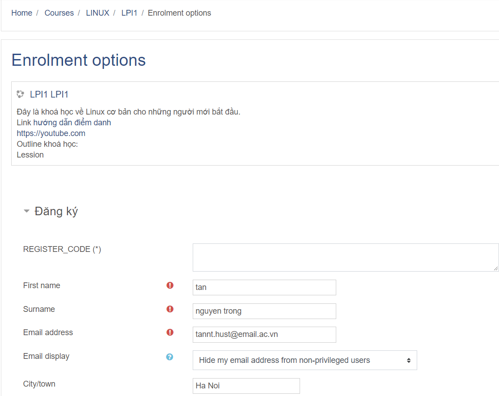

Sau khi học viên đăng ký thì hệ thống đã chuyển học viên đó vào trạng thái chờ confirm.

Ta vào khoá học --> vào `participants` --> tại dòng đăng ký, chọn vào `manage application`. Kiểm tra trường regiter code xem đã đúng chưa, nếu chưa đúng thì chọn cancel để hệ thống gửi email cho học viên kiểm tra lại

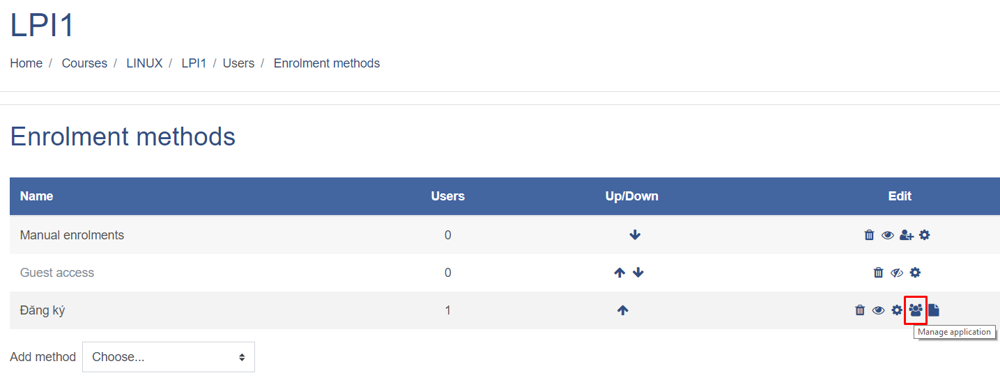

Nếu học viên bị sai code, cancel xong thì học viên sẽ vào đăng ký lại. Nếu code đúng thì chọn trạng thái `defer` để gửi email hướng dẫn học viên chuyển khoản.

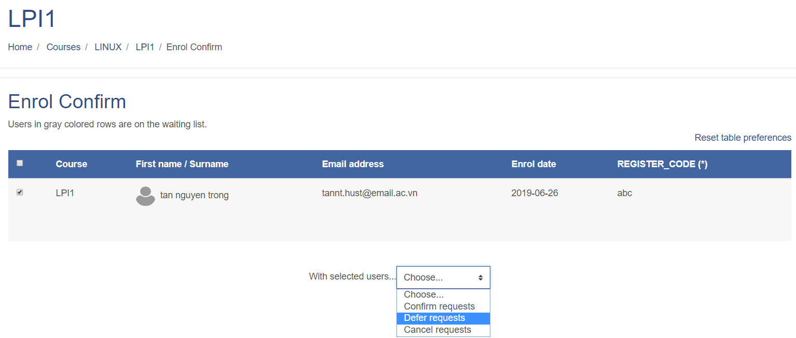

Email nhận được khi chuyển sang trạng thái defer, là trạng thái chờ học viên chuyển tiền cho admin.

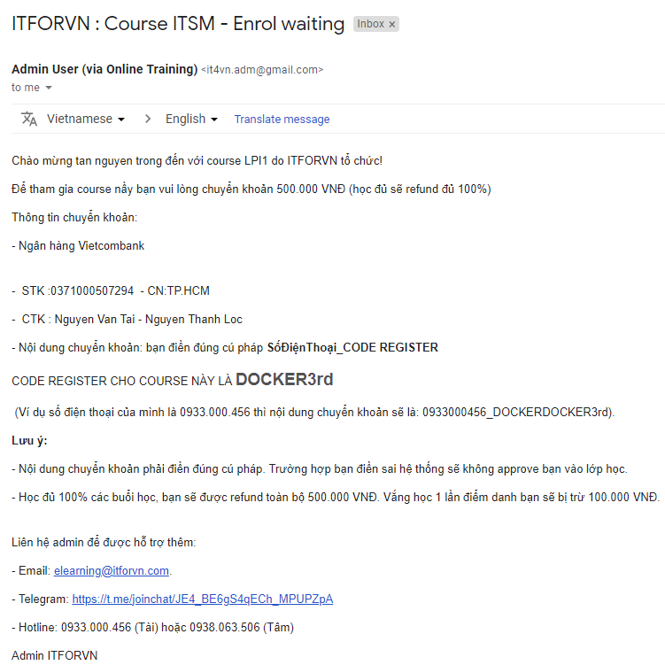

Các user sau khi chuyển trạng thái defer sẽ có nét gạch dọc đậm ở đầu dòng

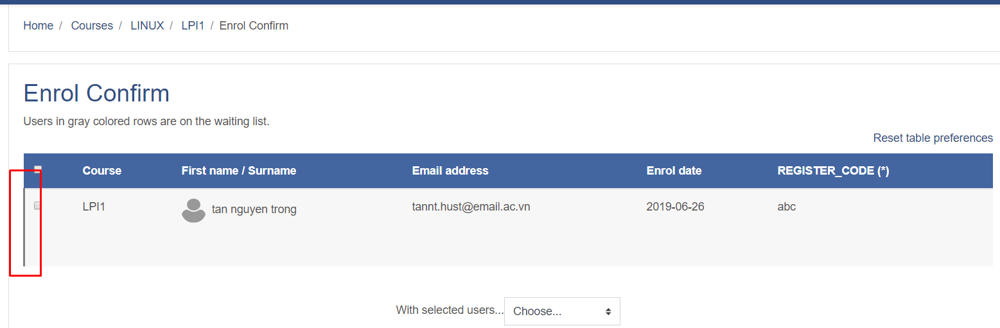

**Một số lưu ý khi tạo email template**:

- Trong content của email sẽ truyền nhiều biến như `{firstname} {lastname} {content}` 
- Các biến này lấy ở đâu, phần này đang tìm hiểu, sẽ note sau

## 10. Tạo quiz

## 11. Thống kê điểm danh

## 12. Tạo certificate

## Tham khảo